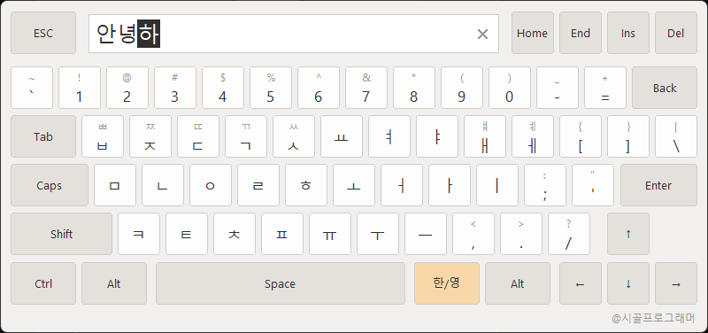

# Virtual Keyboard Component (TSCVirtualKeyboard)

**English** | [한국어](README.ko.md)

A VCL on-screen virtual keyboard for entering Korean (Hangul) and English text with mouse
clicks only. Hangul is composed directly by a built-in **Dubeolsik (two-set) composition
automaton**, so it always composes correctly regardless of the system IME state
(Korean/English mode). See [doc/HangulComposition.md](doc/HangulComposition.md) for the
detailed root-cause analysis, design, and verification (Korean).



## Download (Try It Right Away)

Demo executables and the DLL are distributed via
**[GitHub Releases](https://github.com/civilian7/DelphiKeyboard/releases)** so you can try
them without Delphi. Download the zip, extract it, and run `VirtualKeyboardDemo.exe`
(`sc_vkeyboard.dll` is the native DLL used from C#, Python, C, and other languages).

## Folder Structure

```
DelphiKeyboard\
  src\      SC.Hangul.pas            Dubeolsik composition automaton (THangulComposer) — UI-independent, reusable standalone
            SC.VirtualKeyboard.pas   TSCVirtualKeyboard component + keyboard form (vector rendering, DPI scaling)
  dll\      sc_vkeyboard.dpr         Native DLL project (stdcall exports)
            SC.VKeyboard.Import.pas  Import wrapper for Delphi projects that use the DLL
  lib\dll\  sc_vkeyboard.dll         64-bit DLL (32-bit lives in lib\dll\win32\ — same file name)
  demos\    delphi_native\           Delphi demo — uses the source (src\) directly (VirtualKeyboardDemo.dpr)
            delphi_dll\              Delphi demo — uses the DLL import (VKeyboardDllDemo.dpr)
            csharp\                  C# usage example (net8.0 console, P/Invoke)
            python\                  Python usage example (ctypes)
            c\                       C/C++ usage example (LoadLibrary, MSVC/MinGW)
  bin\      Build output — shared output directory for all language demos
  doc\      HangulComposition.md     Hangul composition problem analysis, automaton design, verification
            DllGuide.md              DLL usage guide (C ABI — per-language examples)
            screenshot.png           Keyboard screenshot
  legacy\   Old IME-dependent implementation (uKeyboard.pas etc.) — kept for reference, excluded from the project
```

The keyboard form is not an IDE-designed form; the component creates it dynamically at
runtime with `CreateNew`, so there is no `.dfm` (the same pattern as the built-in VCL
dialogs). To reuse it in another project, just add the two units from `src\` — no image or
dfm resources to ship.

## Usage

Use the singleton directly (no create/free needed — created on first access, freed
automatically at shutdown).

```pascal
uses
  SC.VirtualKeyboard;

procedure TfrmMain.BtnKeyboardClick(Sender: TObject);
begin
  var LText: string := Edit1.Text;

  if TSCVirtualKeyboard.Instance.Execute(LText) then   // True when confirmed with Enter
  begin
    Edit1.Text := LText;
  end;
end;
```

You can also create a separate instance with `TSCVirtualKeyboard.Create` (a plain class —
no component palette registration required).

### Position and Size

```pascal
// Screen center (default) / main form center
TSCVirtualKeyboard.Instance.Position := kpMainFormCenter;

// Explicit coordinates (screen pixels; auto-corrected if outside the monitor work area)
TSCVirtualKeyboard.Instance.SetCustomPosition(100, 400);

// Size: via properties (logical values at 96 DPI, default 800×376), or
TSCVirtualKeyboard.Instance.Width := 1200;
TSCVirtualKeyboard.Instance.Height := 564;

// per call via Execute parameters (0 or less = use the property values)
TSCVirtualKeyboard.Instance.Execute(LText, 1200, 564);
```

When the size changes, the key layout and fonts all scale proportionally (clamped to a
minimum of 400×188; the monitor DPI scale factor is applied on top).

### Colors

```pascal
TSCVirtualKeyboard.Instance.BackgroundColor := $00202020;   // dark theme example
TSCVirtualKeyboard.Instance.KeyColor := $00383838;
TSCVirtualKeyboard.Instance.KeyTextColor := $00E0E0E0;
```

### Properties

| Property | Description |
|---|---|
| `Language` | Input language when first shown (`klKorean` default / `klEnglish`) |
| `MaxLength` | Maximum number of input characters (including the character being composed). `0` = unlimited (default) |
| `PasswordChar` | Password masking character for the input box (`#0` = show as-is) |
| `Position` | Display position (`kpScreenCenter` default / `kpMainFormCenter` / `kpCustom`) |
| `CustomLeft` / `CustomTop` | Window coordinates when `kpCustom` (screen pixels) |
| `Width` / `Height` | Keyboard size (logical values at 96 DPI, default 800×376) |
| `ClickSound` | Whether to play a key click sound (default `False`). The click is synthesized internally — no resources needed |
| `BackgroundColor` | Form background color |
| `KeyColor` / `SpecialKeyColor` | Face color of regular / special keys |
| `KeyTextColor` / `SubTextColor` | Key label / Shift sub-label color |
| `BorderColor` | Key border color |
| `HotColor` / `PressedColor` / `ToggledColor` | Key face color for mouse-over / pressed / toggled-on states |

### Keyboard Behavior

- **Input display**: the form renders the text itself — no separate edit control. Confirmed
  characters are shown normally; **the character being composed is shown as an inverted
  block**, so the composition state is immediately visible
- **Clear all**: click the **✕** on the right side of the input box to delete all input
- **Caret movement**: click inside the input box, or use Home/End/←/→. Del deletes the
  character after the caret
- **한/영 (Kor/Eng)**: toggles Korean/English (any character being composed is committed)
- **Shift**: one-shot (applies to the next key only — ㅂ→ㅃ, ㅐ→ㅒ, a→A, 1→!)
- **Caps**: toggles English upper/lower case
- **Enter** confirms / **ESC** cancels; drag anywhere outside the keys to move the window
- Physical keyboard is supported as auxiliary input (letters, digits, Backspace, navigation
  keys — Korean is entered via the on-screen keys)
- The window has rounded corners (DWM on Windows 11, window-region fallback on older versions)
- Clicking the `@시골프로그래머` credit at the bottom right opens the GitHub repository

## Using on Non-Korean Windows

The keyboard does not use the OS IME — Hangul is composed by the built-in automaton — so it
works on Windows in **any display language** (English, Japanese, ...) without installing a
Korean IME or changing the system locale. The DLL interface is UTF-16 (`wchar_t`),
independent of the system code page.

### Installing Korean Fonts

The keyboard renders Hangul with **Malgun Gothic**, which is part of the base install of
every desktop edition of Windows regardless of language — normally there is nothing to
install. If Hangul appears as squares (□) — e.g. on Windows Server or a stripped-down
image — install Korean fonts in one of these ways:

- **Settings**: Settings → Apps → Optional features → **Add a feature** → install
  **"Korean Supplemental Fonts"**
- **PowerShell (run as administrator)**:

  ```powershell
  Add-WindowsCapability -Online -Name "Language.Fonts.Kore~~~und-KORE~0.0.1.0"
  ```

- **Language pack**: Settings → Time & Language → Language & region → **Add a language** →
  **한국어 (Korean)**. Korean fonts are installed along with the language pack; the Korean
  IME included there is *not* required by this keyboard

### Console Output Note

On a non-Korean console code page, Hangul printed by the C#/C console demos may show as
`??`. Switch the console output to UTF-8 (`chcp 65001`, or in C#
`Console.OutputEncoding = System.Text.Encoding.UTF8`). This affects console *display*
only — the keyboard input itself is unaffected (Python 3.6+ writes via the console API and
has no such issue).

## Native DLL (Use from Other Languages)

From C#, C/C++, Python, and any language with C ABI (FFI) support, use `sc_vkeyboard.dll`.
The 32-bit and 64-bit DLLs share the **same file name** and are separated by folder
(64-bit in `lib\dll\`, 32-bit in `lib\dll\win32\`).

> Since Delphi requires a commercial license, **prebuilt DLLs are included in the
> repository** — you can use the DLL without Delphi. For detailed per-language usage
> (C/C++, C#, Python, Delphi, and general FFI notes), see
> **[doc/DllGuide.md](doc/DllGuide.md)** (Korean).

### Exports (stdcall)

```c
// Returns 1 = confirmed with Enter, 0 = canceled with ESC, -1 = error.
// buffer is a null-terminated Unicode in/out buffer (1024 chars recommended).
// (bufferSize - 1) is applied as the maximum input length (v1.2+ — no result truncation)
int VKB_Show(wchar_t* buffer, int bufferSize,
             int language,          // 0 = English, 1 = Korean
             int left, int top,     // both -1 = screen center (screen pixels)
             int width, int height, // logical values at 96 DPI, 0 or less = default 800×376
             const wchar_t* title,  // reserved (ignored, kept for ABI compatibility) — pass NULL
             wchar_t passwordChar); // L'\0' = show as-is

void VKB_SetClickSound(int enabled); // key click sound (0 = off, default). Takes effect from the next VKB_Show (v1.1+)

int VKB_Version(); // high byte = major, low byte = minor
```

### C# Example (`demos\csharp\`)

```csharp
[DllImport("sc_vkeyboard.dll", CharSet = CharSet.Unicode)]
static extern int VKB_Show(StringBuilder buffer, int bufferSize,
    int language, int left, int top, int width, int height,
    string? title, char passwordChar);

[DllImport("sc_vkeyboard.dll")]
static extern void VKB_SetClickSound(int enabled);

VKB_SetClickSound(1);   // enable key click sound (optional)

var buffer = new StringBuilder("안녕하세요", 1024);
if (VKB_Show(buffer, buffer.Capacity, 1, -1, -1, 0, 0, null, '\0') == 1)
{
    Console.WriteLine($"Input: {buffer}");
}
```

Run: `cd demos\csharp && dotnet run` (net8.0, x64).
Build output goes to the shared `bin\` folder, and `sc_vkeyboard.dll` is copied along with it.

### Python Example (`demos\python\`)

```python
import ctypes

vkb = ctypes.WinDLL("sc_vkeyboard.dll")   # WinDLL = stdcall
vkb.VKB_SetClickSound(1)                  # enable key click sound (optional)

buffer = ctypes.create_unicode_buffer("안녕하세요", 1024)
if vkb.VKB_Show(buffer, 1024, 1, -1, -1, 0, 0, None, ord("\0")) == 1:
    print("Input:", buffer.value)
```

Run: `python demos\python\vkeyboard_demo.py` (automatically picks the DLL matching the
process bitness)

### C/C++ Example (`demos\c\`)

Uses `LoadLibrary`/`GetProcAddress`, so no import library is required.

```
cl /W4 vkeyboard_demo.c /Fe:..\..\bin\vkeyboard_demo_c.exe               (MSVC)
gcc -Wall -municode vkeyboard_demo.c -o ..\..\bin\vkeyboard_demo_c.exe   (MinGW)
```

### Using the DLL from Delphi (`demos\delphi_dll\`)

To use the DLL instead of the source (`src\`), add `dll\SC.VKeyboard.Import.pas` to your
uses clause and call `VKB_Show` (the DLL name constant is shared by 32/64-bit — no IFDEF
needed). See the console example `demos\delphi_dll\VKeyboardDllDemo.dpr` —
`sc_vkeyboard.dll` must be next to the executable.

### Building the DLL

```
cd dll
dcc64.exe sc_vkeyboard.dpr -U"...\lib\win64\release" -E..\lib\dll -N..\lib\dll
dcc32.exe sc_vkeyboard.dpr -U"...\lib\win32\release" -E..\lib\dll\win32 -N..\lib\dll\win32
```

## Build

Win64 is the primary target. Outputs are separated by bitness via folders
(64-bit `bin\`, 32-bit `bin\win32\`).

```
cd demos\delphi_native

:: Win64 (default)
dcc64.exe VirtualKeyboardDemo.dpr -U"C:\Program Files (x86)\Embarcadero\Studio\37.0\lib\win64\release" -E..\..\bin -N..\..\bin

:: Win32 (when needed)
dcc32.exe VirtualKeyboardDemo.dpr -U"C:\Program Files (x86)\Embarcadero\Studio\37.0\lib\win32\release" -E..\..\bin\win32 -N..\..\bin\win32
```

Or open `demos\delphi_native\VirtualKeyboardDemo.dpr` in the Delphi IDE and build (for
32-bit, add the Windows 32-bit platform in the Project Manager). The source is
bitness-independent, so there are no IFDEF branches. The DLL import demo
(`demos\delphi_dll\VKeyboardDllDemo.dpr`) builds the same way.

> High-DPI: the key layout and fonts are logical values at 96 DPI, scaled by `CurrentPPI`.
> Set the DPI awareness to **PerMonitorV2** in the project options.

## Changelog

### 2026-07-11 (v1.3)

- **Font matching fix for non-Korean Windows**: the input-display font was specified by its
  Korean localized name (`'맑은 고딕'`), which can fail to match on non-Korean Windows;
  changed to the canonical English name **`'Malgun Gothic'`** so rendering is identical on
  Windows in any language
- **README**: added a section on non-Korean Windows support and installing Korean fonts
- DLLs rebuilt with the fix (`VKB_Version` now returns 1.3; no ABI changes)

### 2026-07-10 (v1.2)

- **Input display redesign**: removed the `TEdit`; the form now renders the text directly
  (a structure suited to a mouse-only input tool). Confirmed characters are shown normally;
  **the character being composed is shown as an inverted block**. The caret is drawn as a
  vertical bar and moves via clicks in the input box or Home/End/←/→
- **Clear all**: the ✕ button on the right side of the input box deletes all input
- **Maximum input length**: added the `MaxLength` property (0 = unlimited, default;
  includes the character being composed). The DLL automatically applies `bufferSize - 1`
  as the maximum length, eliminating result truncation

### 2026-07-10 (v1.1)

- **Title removed**: removed the title at the top left of the keyboard window along with the
  `Title`/`TitleTextColor` properties (the DLL `title` argument is kept as a reserved
  parameter for ABI compatibility — existing callers need no changes)
- **Rounded corners**: the keyboard window border is now rounded (DWM on Windows 11,
  window-region fallback on older versions)
- **Author credit**: added the `@시골프로그래머` label at the bottom right — clicking it
  opens the GitHub repository
- **Click sound**: added the `ClickSound` property (off by default) and the DLL
  `VKB_SetClickSound` export. The click is synthesized internally — no sound files or
  resources needed
- **Releases distribution**: demo executables + DLL zip are published via GitHub Releases

### 2026-07-10

- **Root-cause fix for Hangul composition**: removed the OS IME dependency (SendInput key
  injection) and embedded a Dubeolsik composition automaton (`SC.Hangul.pas`). Details in
  [doc/HangulComposition.md](doc/HangulComposition.md)
- **Restructured as a reusable class**: `TSCVirtualKeyboard` (a plain class inheriting
  `TObject` — no component palette registration required). Removed the GIF resources and
  global mouse hook; switched to vector rendering
- **Singleton support**: `TSCVirtualKeyboard.Instance.Execute(...)` — use without
  create/free; freed automatically at program shutdown
- **Display position**: `Position` (`kpScreenCenter`/`kpMainFormCenter`/`kpCustom`),
  `SetCustomPosition(ALeft, ATop)` — auto-corrected to the monitor work area
- **Size control**: `Width`/`Height` properties or `Execute(AText, AWidth, AHeight)`
  parameters (logical values at 96 DPI, default 800×378). Key layout and fonts scale
  proportionally
- **Color customization**: 10 color properties — background, keys, text, borders, and
  states (hover/pressed/toggled)
- **Folder restructuring**: `src\` / `demos\` / `bin\`(+`win32\`) / `doc\` / `legacy\`;
  renamed the demo from `Project1` to `VirtualKeyboardDemo`
- **Native DLL**: added `sc_vkeyboard.dll` (32/64-bit, stdcall `VKB_Show`/`VKB_Version`)
  and a Delphi import wrapper. Prebuilt DLLs are included in `lib\dll\` (no Delphi needed)
- **Multi-language samples and guide**: split the demos into `delphi_native\` (uses the
  source) / `delphi_dll\` (uses the DLL) / `csharp\` / `python\` / `c\`; added the C ABI
  usage guide (`doc\DllGuide.md`)

## License

[MIT License](LICENSE). Exception: the `legacy\` folder preserves a port of
community-shared source code (see below) for reference; since the original author did not
specify a license, it is excluded from the MIT license.

## Origin (Original Authors)

The old implementation in `legacy\` is a Delphi port of the C++Builder source shared on the
Borland Forum components board:
"[한/영 입력 가능한 가상 키보드 입니다.](http://cbuilder.borlandforum.com/impboard/impboard.dll?action=read&db=component&no=836)"
(godson2, 2021-12-30). That post states it is an adaptation of **Park Young-mok**'s
original source, updated to work with C++Builder 11. The current `src\` implementation
(composition automaton, vector rendering) is a complete rewrite except for the key layout
coordinate table.
