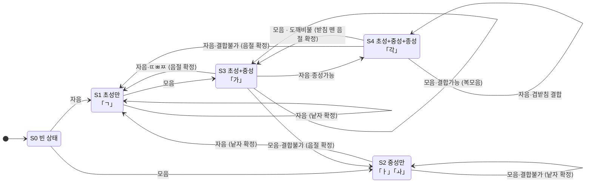
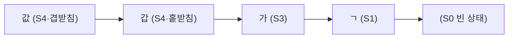

# 한글 조합 문제 — 근본 원인 분석과 해결

## 증상

가상 키보드로 한글 자모를 클릭하면 조합되지 않고 낱자(ㅇ ㅏ ㄴ ...)로 입력되거나,
환경에 따라 아예 영문으로 입력됨.

## 근본 원인

기존 구현(`legacy/uKeyboard.pas`)은 `SendInput`/`keybd_event` 로 가상 키 이벤트를 주입하고
**조합을 OS 한글 IME 에 전적으로 의존**했다. 이 구조는 다음 이유로 환경에 따라 깨진다.

1. **IME 상태를 프로그램이 보장할 수 없음** — IME 한/영 모드는 포커스 창별로 관리되며,
   가상 키보드 쪽에서 강제할 방법이 없다. IME 가 영문 모드면 자모 키가 그대로 영문자가 된다.
2. **주입된 `VK_HANGUL` 토글의 신뢰성 부족** — Windows 10/11 신형 한국어 IME 는
   `SendInput` 으로 주입된 한/영 전환 키($15)를 무시하는 경우가 있다.
3. **`VkKeyScanA` 상위 바이트 유실** — 반환값 상위 바이트(Shift 상태)를 버려
   Shift 조합 문자 입력도 부정확했다.
4. 스캔코드를 `MapVirtualKey` 로 채워 보내는 보완(이전 수정)으로도 1·2번은 해결되지 않는다.

## 해결

**IME 의존을 완전히 제거**했다. 상용 보안 키패드와 같은 방식으로, 두벌식 조합 오토마타를
컴포넌트에 내장(`src/SC.Hangul.pas` 의 `THangulComposer`)해 자모를 직접 완성형 음절로
조합하고 입력창에 기록한다. 키 주입(`SendInput`)과 전역 마우스 훅(`SetWindowsHookEx`)도
모두 제거되어 전역 상태 없이 동작한다.

### 오토마타가 처리하는 규칙

- 초성 19 / 중성 21 / 종성 28 조합: `음절 = $AC00 + (초성×21 + 중성)×28 + 종성`
- 복모음 결합: ㅗ+ㅏ→ㅘ, ㅗ+ㅐ→ㅙ, ㅗ+ㅣ→ㅚ, ㅜ+ㅓ→ㅝ, ㅜ+ㅔ→ㅞ, ㅜ+ㅣ→ㅟ, ㅡ+ㅣ→ㅢ
- 겹받침 결합: ㄳ ㄵ ㄶ ㄺ ㄻ ㄼ ㄽ ㄾ ㄿ ㅀ ㅄ
- 도깨비불: 받침 있는 상태에서 모음 입력 시 받침(겹받침이면 뒤 자음만)이
  새 음절의 초성으로 이동 — "갑" + ㅅ + ㅏ → "갑사", "값" + ㅏ → "갑사"
- 조합 중 백스페이스: 자모 단위 역조합 (닭 → 달 → 다 → ㄷ), 겹받침→홑받침, 복모음→단모음
- ㄸ/ㅃ/ㅉ 는 받침 불가 → 새 음절 시작

## 동작 원리 — 상태 기계

### 상태 정의

오토마타의 상태는 `(FCho, FJung, FJong)` 세 인덱스로 표현된다
(초성 0..18 / 중성 0..20 / 종성 0..27 — 종성 0 은 "받침 없음", 초·중성 -1 은 "없음").
이 조합이 만드는 상태는 다섯 가지다.

| 상태 | (초성, 중성, 종성) | 화면 표시 (ComposeText) | 예 |
|---|---|---|---|
| **S0** 빈 상태 | (-1, -1, 0) | (없음) | |
| **S1** 초성만 | (c, -1, 0) | 낱자 자음 | ㄱ |
| **S2** 중성만 | (-1, v, 0) | 낱자 모음 | ㅏ, ㅘ |
| **S3** 초성+중성 | (c, v, 0) | 완성형 음절 | 가 |
| **S4** 초성+중성+종성 | (c, v, j>0) | 완성형 음절 | 각 |

핵심 설계 두 가지:

1. **표시 텍스트는 상태에서 파생된다** — S3/S4 는
   `Char($AC00 + (초성×21 + 중성)×28 + 종성)` 공식으로 즉석 계산하고,
   S1/S2 는 호환 자모 낱자를 그대로 보여준다. 별도의 "조합 버퍼 문자열"이 없으므로
   상태와 화면이 어긋날 수 없다.
2. **Mealy 머신** — 전이할 때 출력(`ACommitted`, 확정 텍스트)이 나온다.
   화면 불변식은 `화면 = 확정분 누적 + ComposeText(현재 상태)` 이고, `Feed` 가 돌려주는
   (확정분, 조합분) 쌍으로 호출자가 조합 구간만 교체한다.

### 상태 전이도

전이 레이블은 `입력 조건 ⟨확정 출력⟩` 형식이다. 입력은 자음/모음 두 클래스뿐이다.

### 전이 규칙 상세

- **S1, 자음**: 두벌식은 초성끼리 결합하지 않으므로 앞 자음을 낱자로 확정하고 새로 시작
  ("ㄱ"+ㄷ → "ㄱ" 확정 + "ㄷ" 조합)
- **S2/S3, 모음**: `CombineJung` 으로 복모음 결합 시도 (ㅗ+ㅏ→ㅘ 등 7종).
  결합 불가면 현재 글자를 확정하고 새 낱자 모음으로 S2
- **S3, 자음**: 종성 가능하면 S4. **ㄸ/ㅃ/ㅉ 는 종성이 될 수 없으므로**
  음절 확정 후 새 초성으로 S1 ("바"+ㅃ → "바" 확정 + "ㅃ" 조합)
- **S4, 자음**: `CombineJong` 으로 겹받침 결합 시도 (ㄱ+ㅅ→ㄳ 등 11종).
  불가면 음절 확정 후 S1
- **S4, 모음 (도깨비불)**: 받침이 다음 음절의 초성으로 이동한다.
  홑받침은 통째로 이동 ("각"+ㅏ → "가" 확정 + "가" 조합),
  겹받침은 `SplitJong` 으로 분해해 **앞 받침은 남기고 뒤 자음만 이동**
  ("값"+ㅏ → "갑" 확정 + "사" 조합).
  유일하게 "확정 직전 글자가 소급 수정되는 것처럼 보이는" 전이지만, 실제로는 받침을
  떼어낸 형태로 확정하므로 이미 확정된 텍스트는 절대 다시 건드리지 않는다

### 백스페이스 (역전이)

마지막 자모 하나만 되돌린다. 우선순위는 종성 → 중성 → 초성:

- **S4**: 겹받침 → 홑받침 (값→갑), 홑받침 → 제거 (각→가, S3 로)
- **S3/S2**: 복모음 → 첫 모음 (과→고, ㅢ→ㅡ), 단모음 → 제거 (가→ㄱ, ㅏ→빈 상태)
- **S1**: 초성 제거 → S0
- **S0**: `False` 반환 — 조합 중이 아니므로 호출자가 에디트의 일반 문자 삭제로 처리

비대칭 주의: **한 번의 키 입력으로 들어온 자모는 통째로 지워진다** — 종성 ㅆ(Shift+ㅅ 한 타)은
ㅅ으로 줄지 않고 바로 제거되고 ㅒ/ㅖ도 마찬가지다. 분해 대상은 두 타로 *결합된*
겹받침·복모음뿐이다 (`SplitJong`/`ReduceJung` 테이블에 결합형만 등재).

### 전이 추적 예시

**"값이"** (ㄱ ㅏ ㅂ ㅅ ㅇ ㅣ):

| 입력 | 전이 | 확정 출력 | 조합 표시 |
|---|---|---|---|
| ㄱ | S0 → S1 | | ㄱ |
| ㅏ | S1 → S3 | | 가 |
| ㅂ | S3 → S4 | | 갑 |
| ㅅ | S4 → S4 (겹받침) | | 값 |
| ㅇ | S4 → S1 (결합불가) | "값" | ㅇ |
| ㅣ | S1 → S3 | | 이 |

→ 최종 "값이"

**"갑사"** (ㄱ ㅏ ㅂ ㅅ ㅏ) — 마지막 입력만 다른데 결과가 갈린다:

| 입력 | 전이 | 확정 출력 | 조합 표시 |
|---|---|---|---|
| ㅅ | S4 → S4 (겹받침) | | 값 |
| ㅏ | S4 → S3 (도깨비불) | "갑" | 사 |

→ 최종 "갑사"

같은 "값" 상태에서 자음이 오면 음절 경계가 받침 *뒤*에서, 모음이 오면 받침 *가운데*서
갈라진다. 이 지연 결정(다음 입력을 봐야 경계가 확정됨)이 두벌식 오토마타의 본질이고,
S4 의 두 갈래 전이로 구현되어 있다.

### 조합 표시 방식

조합 중인 글자는 항상 에디트에 실제로 기록되어 있고, 오토마타 상태만 별도로 유지한다.
`Feed` 가 돌려주는 (확정분, 조합분)으로 조합 시작 위치부터의 텍스트를 교체한다.
물리 키보드 입력·커서 이동이 끼어들면 조합 상태만 리셋하면 되므로(`CommitComposition`)
텍스트가 깨질 여지가 없다.

## 검증

- **오토마타 단위 검증** (22케이스): 안녕/한글/닭/삶/꽃/의사/값, 도깨비불(갑사·가사),
  복모음(ㅘ 단독, 띄), 모음→자음 전환, 백스페이스 역조합 전 단계 — 전부 통과
- **엔드투엔드 검증**: 빌드된 키보드 폼의 키 좌표에 마우스 메시지를 보내
  클릭 시퀀스 ㄴㅓㄴㅁㅕㄴ 이 단계별로 ㄴ→너→넌→넌ㅁ→넌며→넌면 으로 조합되고
  Enter 로 "넌면"이 확정 반환되는 것을 확인
